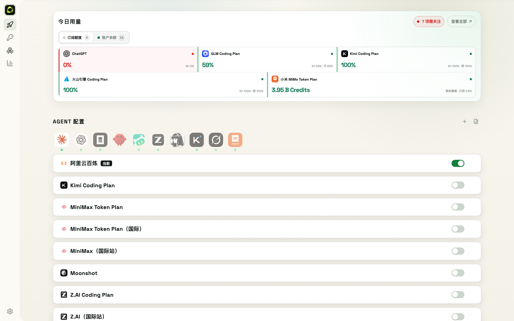

# 2. Console Overview

| Page | What it does |
|------|--------------|
| Quick Start | Home cockpit: agent switching, provider toggles, today's usage |
| Vault | Encrypted key vault: manual add, auto-create, project binding, sync |
| Models | 40 provider presets: endpoints, auth, model lists, plans |
| Usage | Queries and alerts across 30+ subscription/balance sources |
| Agents | Config adapters & one-click model switching for 10 agents |
| Catalog | Official pricing & capability comparison across platforms |
| Settings | Language & appearance, device sync, cloud backup, config history (snapshots) |

Interface language and theme are switched in **Settings → Language & Appearance**.
