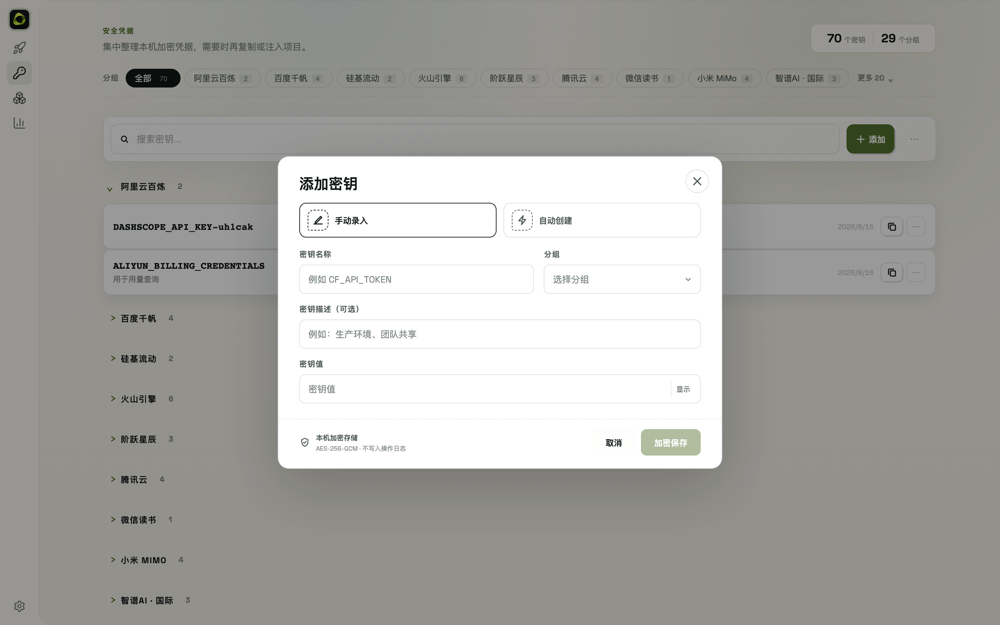

# 4. Auto-creating Keys

## 4.1 Prerequisites

- Extension installed and connected (chapter 3)
- **Chrome is logged in to the target platform** (auto-create reuses that session)

## 4.2 Workflow

1. Console → **Vault** → **Auto-create**
2. Pick a platform (31 supported, see table)
3. OKIT opens a browser window, navigates to the platform's API key page, fills in the name, clicks create, and copies the new key
4. The key lands in the local encrypted vault (AES-256-GCM); it is never written in plaintext

## 4.3 Supported platforms

| Group | Platforms |
|-------|-----------|
| International | OpenAI, Anthropic, Cloudflare, xAI (Grok), Mistral, OpenRouter |
| Zhipu | Zhipu AI (CN), Z.AI (international) |
| Volcengine | Volcengine, Volcengine Agent Plan |
| Tencent Cloud | Tencent Cloud, Tencent Cloud Token Plan |
| MiniMax | MiniMax CN/international, MiniMax Token Plan CN/international |
| Moonshot | Moonshot, Moonshot Coding Plan, Kimi CN, Kimi international |
| Alibaba Cloud | Aliyun Bailian, Bailian Coding Plan, Bailian Token Plan |
| Baidu | Baidu Qianfan, Qianfan Token Plan |
| Others | DeepSeek, SiliconFlow, Xiaomi MiMo (+ Token Plan), StepFun, OpenCode Go |

## 4.4 Special cases

- **Volcengine**: the platform may pop up a security or SMS verification mid-flow — complete it manually and the extension takes over again (semi-automatic)
- **Z.AI / Baidu Qianfan Token Plan**: the key is read via the "copy" control on the list page; if the control returns a masked value, OKIT explicitly **stops and asks you to copy manually** — better to store nothing than to store a mask
- **Anthropic**: keep the browser in the foreground after creation; the extension reads the key via the "copy" button
