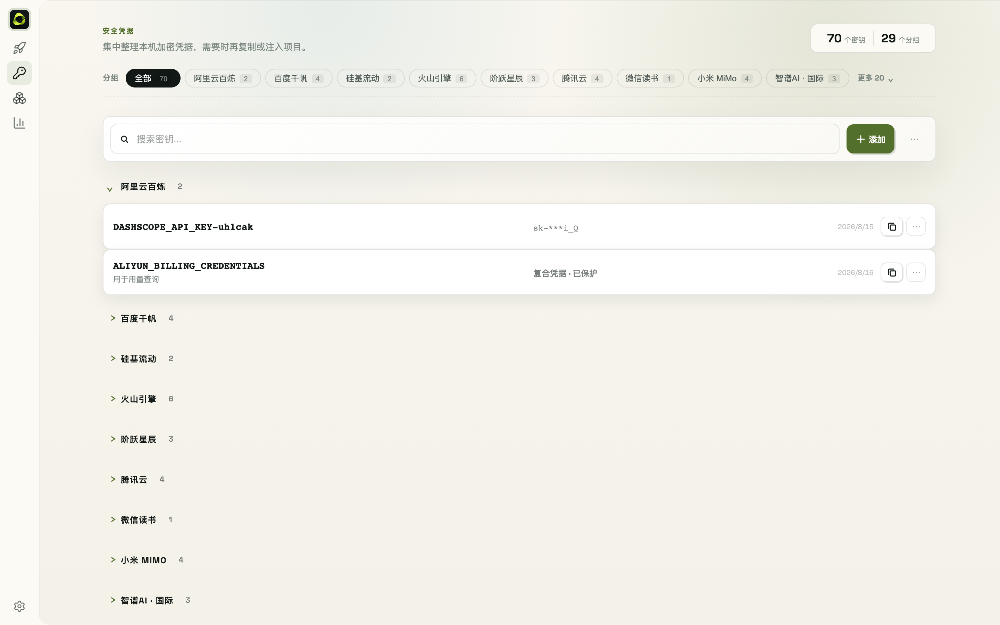

# 5. Working with the Vault



## 5.1 Add & view

- **Add manually**: Vault → Add; give the key a name, paste the value, optionally add a note
- **Viewing**: keys are masked by default; the full value can be revealed on demand. Keys are stored encrypted (AES-256-GCM) under `~/.okit` on your machine
- **Command line**:

```bash
okit vault list                  # list all keys (masked)
okit vault set <key>             # store a key (interactive, recommended)
printf '%s' "$SECRET" | okit vault set <key> --stdin   # automation: keeps the secret out of shell history
okit vault get <key>             # print plaintext
okit vault delete <key>          # delete
```

## 5.2 Project binding (auto-inject .env)

Keys can be bound to project directories — OKIT writes them into the project's `.env`:

1. Create a `.okitenv` file in the project root listing the key names you need, e.g. `OPENAI_API_KEY`
2. Run `okit vault env`; OKIT generates `.env` from `.okitenv` and registers the association
3. Run `okit vault sync` afterwards to refresh all associated files in one shot

```bash
okit vault where <key>           # which projects use a key
okit vault inject                # print export statements (use with eval)
okit vault inject --shell zsh    # shell format: bash/zsh/powershell
```

## 5.3 Auto-inject on cd (optional)

```bash
okit hook install               # cd hook: auto-export keys when entering a project
okit hook status                # check installation
okit hook uninstall             # remove
```

> **Shell config safety**: installing or upgrading OKIT **never** modifies your shell config (`~/.zshrc` / `~/.bashrc` etc.). Only an explicit `okit hook install` writes the cd hook, and `okit hook uninstall` removes it.
