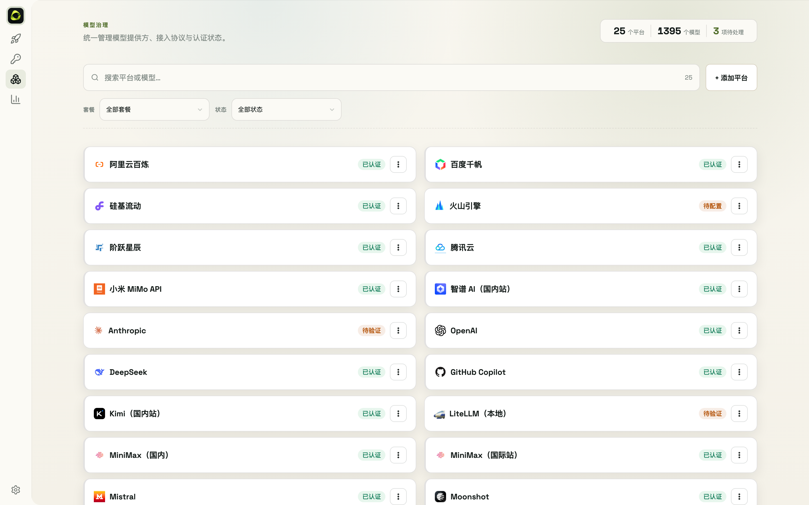

# 7. Model Providers



- The **Models** page ships 40 provider presets (official APIs, aggregators, Chinese platforms) — click a card to configure
- Each provider takes three things: **endpoint** (official API or compatible endpoint), **auth method** (API key / OAuth, mutually exclusive), and the **key** (pick from the vault or paste)
- Card menu (top right):
  - **Connect**: test connectivity and pull the platform's model list
  - **Docs**: jump to the official documentation
- Provider configs support **import/export** for cross-device migration
- Command line:

```bash
okit provider list              # list all providers (--json for scripts)
okit provider add               # add
okit provider delete <name>     # delete
okit provider auth              # auth status of all providers
```
