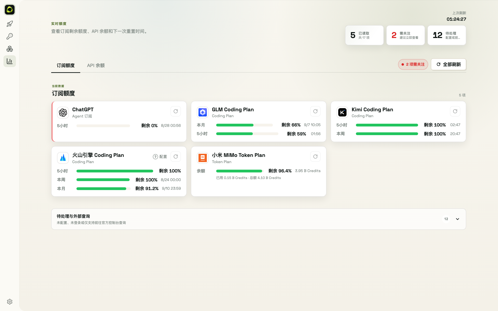

# 9. Usage & Alerts

- The **Usage** page shows remaining quota per subscription plan (5h / weekly / monthly windows) and prepaid balances, covering 30+ sources
- Smart polling refreshes automatically; remaining ≤30% triggers a yellow alert, ≤10% a red alert plus a browser notification (grant the notification permission when prompted)
- The Quick Start page also shows a today's-usage summary
