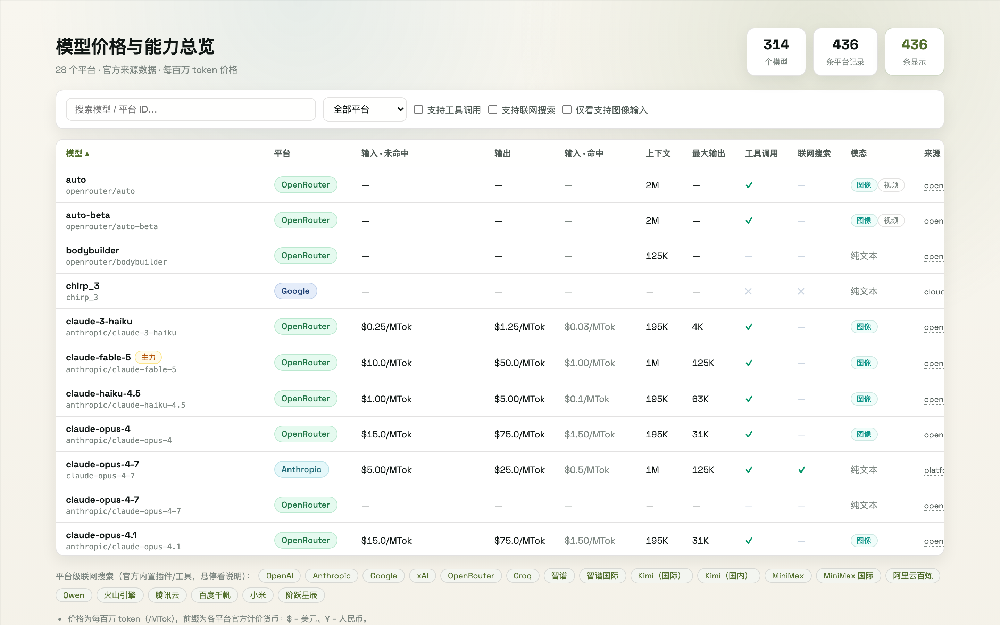

# 10. Model Catalog

The **Catalog** page consolidates official data for all platforms:

- Input / output / cache prices (per million tokens), peak & off-peak hours shown directly
- Context windows and capability tags for comparison

Use it when picking models or comparing prices instead of digging through vendor sites.
