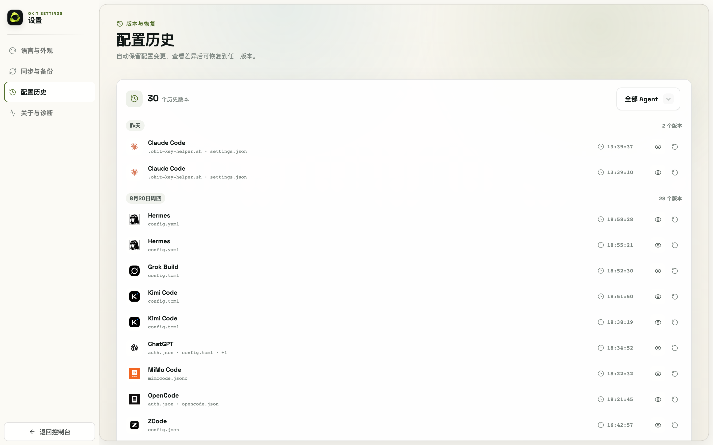

# 11. Config Snapshots & Restore

OKIT automatically snapshots the current config **before every provider/model switch**.

1. Go to **Settings → Config History**
2. Filter by agent (or view all); each version shows its timestamp
3. Click **View** for a side-by-side diff, then **Restore** to roll back
4. Restoring takes its own safety snapshot first, so a restore itself is reversible

Bad switch, broken config, or "last week's combo" — this is where you get it back.
