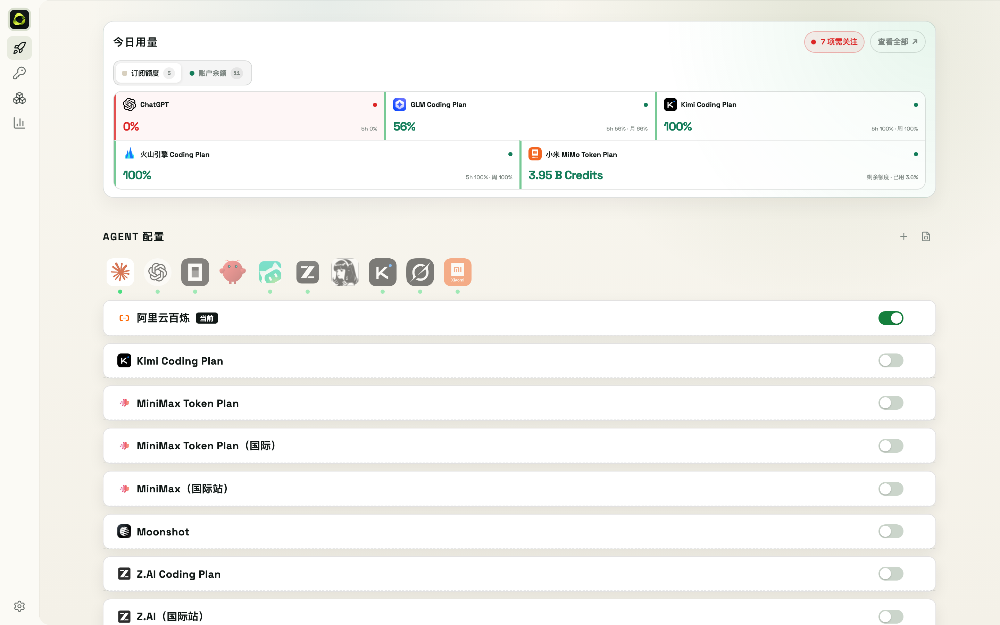

# 8. Agent 配置与模型切换



OKIT 适配 10 个 Agent：**Claude Code、ChatGPT (Codex)、Kimi Code、WorkBuddy、Hermes、OpenCode、OpenClaw、ZCode、Grok、MiMo Code**。

## 8.1 切换模型（Web）

1. **快速启动**页顶部选择 Agent
2. 打开对应 Provider 的启用开关
3. 点击模型 chip 即完成切换

配置文件（`config.toml`、`auth.json`、`settings.json` 等）由 OKIT 自动写对，不需要手动编辑。

> OKIT 采用**外科手术式写入**：只改 OKIT 管理的字段，你自己配置的 hooks、statusLine、MCP 等内容原样保留。每次切换前自动生成配置快照（见第 11 章），出问题随时恢复。

## 8.2 切换模型（CLI）

```bash
okit provider switch            # 交互式切换（可指定 agent）
okit provider use <provider> --agent codex --model <model-id>   # 非交互式，脚本/CI 友好
okit provider current           # 查看所有 Agent 当前配置
```

## 8.3 其他说明

- **Codex 用户**：切换后 OKIT 会生成原生模型目录，你可以直接在 Codex CLI 里用 `/model` 切换，不必回到 OKIT
- **配置查看器**：Agent 配置页可查看（并编辑）OKIT 为该 Agent 写入的配置文件内容
- **停用 Provider**：把启用开关关掉即回退该 Agent 的官方默认配置，数据不删除
